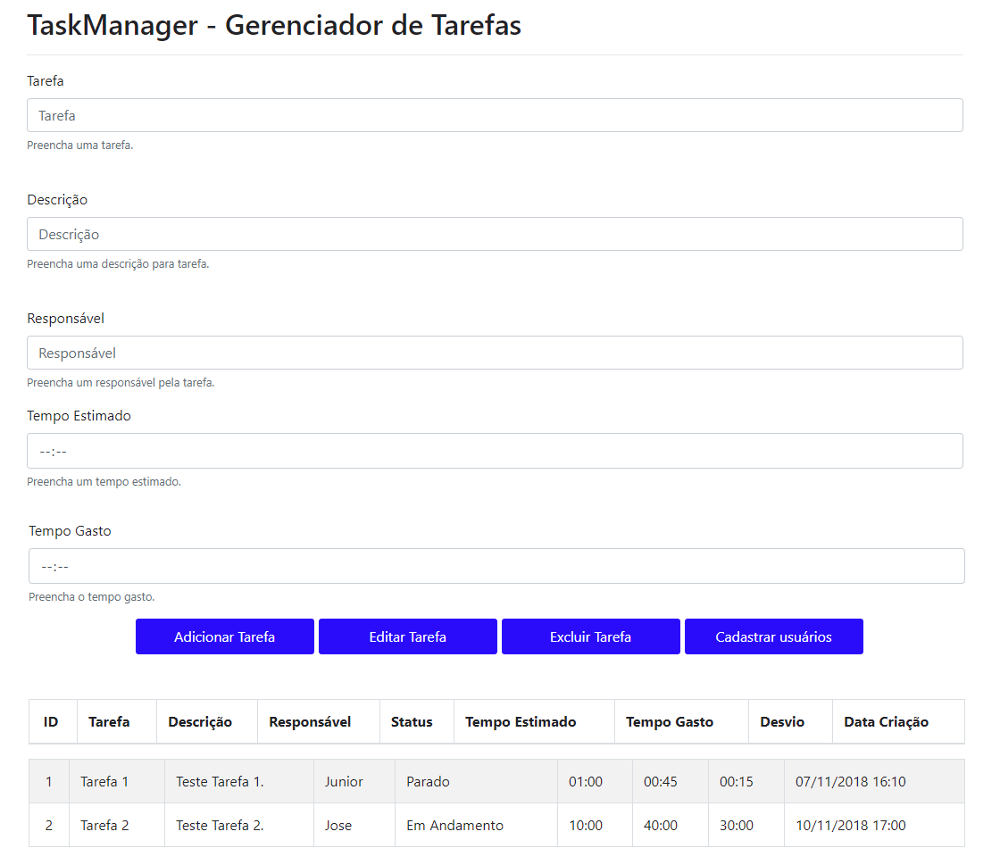
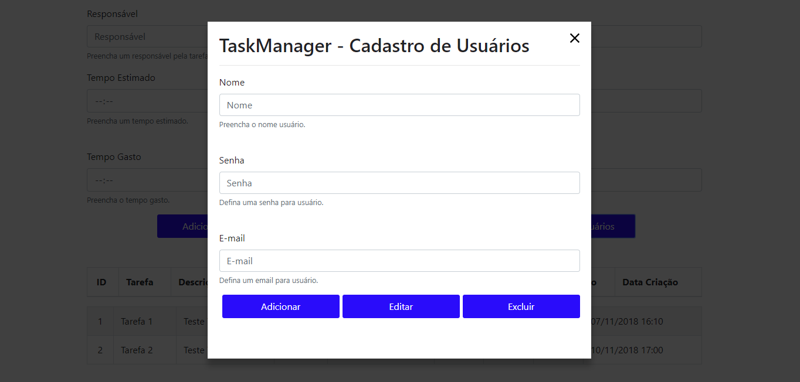

# 📋 Task Manager - Sistema de Gerenciamento de Tarefas


## 📋 Índice

- [Sobre o Projeto](#sobre-o-projeto)
- [Arquitetura da Aplicação](#arquitetura-da-aplicação)
- [Tecnologias Utilizadas](#tecnologias-utilizadas)
- [Funcionalidades](#funcionalidades)
- [Estrutura do Projeto](#estrutura-do-projeto)
- [Modelo de Dados](#modelo-de-dados)
- [Pré-requisitos](#pré-requisitos)
- [Instalação e Configuração](#instalação-e-configuração)
- [Executando o Projeto](#executando-o-projeto)
- [API REST - Endpoints](#api-rest---endpoints)
- [Frontend - Interface do Usuário](#frontend---interface-do-usuário)
- [Testes](#testes)
- [Padrões e Boas Práticas](#padrões-e-boas-práticas)
- [Roadmap](#roadmap)
- [Contribuindo](#contribuindo)
- [Licença](#licença)

---

## 📖 Sobre o Projeto

O **Task Manager** é uma aplicação full-stack completa para gerenciamento de tarefas e usuários, desenvolvida com tecnologias modernas e escaláveis. O projeto demonstra a integração entre um backend robusto em **Java Spring Boot** e um frontend interativo em **React**, com persistência de dados em **PostgreSQL**.

### 🎯 Propósito

Este sistema permite que equipes e indivíduos gerenciem suas tarefas de forma eficiente, controlando:
- ✅ Criação, edição e exclusão de tarefas
- ✅ Atribuição de responsáveis
- ✅ Controle de tempo estimado vs. tempo gasto
- ✅ Status de progresso das tarefas
- ✅ Cadastro e gerenciamento de usuários
- ✅ Cálculo automático de desvios de tempo

### 🌟 Diferenciais

- **Arquitetura em Camadas**: Separação clara entre apresentação, negócio e dados
- **API RESTful**: Comunicação padronizada e documentada
- **CORS Habilitado**: Integração facilitada entre frontend e backend
- **Interface Responsiva**: Layout adaptável usando Bootstrap
- **Caching Inteligente**: Otimização de performance com Spring Cache
- **Hot Reload**: Desenvolvimento ágil com Spring DevTools e React Scripts

---

## 🏗️ Arquitetura da Aplicação

### **Arquitetura Geral**

```
┌─────────────────────────────────────────────────────────────┐
│                    FRONTEND (React)                         │
│  ┌─────────────┐  ┌──────────────┐  ┌──────────────┐        │
│  │   App.js    │  │ TaskManager  │  │ UserRegister │        │
│  │  (Main)     │─▶    Form            Modal                 
│  └─────────────┘  └──────────────┘  └──────────────┘        │
│           │                                                 │
│           │ HTTP/REST (Port 3000)                           │
└───────────┼─────────────────────────────────────────────────┘
            │
            ▼ AJAX Requests
┌──────────────────────────────────────────────────────────────┐
│                 BACKEND (Spring Boot)                        │
│  ┌──────────────────────────────────────────────────────┐    │
│  │              Controllers Layer                       │    │
│  │  ┌──────────────────┐  ┌──────────────────┐          │    │
│  │  │ TaskController   │  │  UserController  │          │    │
│  │  │ (@RestController)    (@RestController) │          │    │
│  │  └────────┬─────────┘  └────────┬─────────┘          │    │
│  └───────────┼─────────────────────┼────────────────────┘    │
│              │                     │                         │
│  ┌───────────┼─────────────────────┼────────────────────┐    │
│  │           │  Services Layer     │                    │    │
│  │  ┌────────▼────────┐  ┌────────▼────────┐            │    │
│  │  │  TaskService    │  │  UserService    │            │    │
│  │  │  Implementation │  │  Implementation │            │    │
│  │  └────────┬────────┘  └────────┬────────┘            │    │
│  └───────────┼─────────────────────┼────────────────────┘    │
│              │                     │                         │
│  ┌───────────┼─────────────────────┼────────────────────┐    │
│  │           │  Repositories (JPA) │                    │    │
│  │  ┌────────▼────────┐  ┌────────▼────────┐            │    │
│  │  │ TaskRepository  │  │ UserRepository  │            │    │
│  │  │  (JpaRepository)   (JpaRepository)   │            │    │
│  │  └────────┬────────┘  └────────┬────────┘            │    │
│  └───────────┼─────────────────────┼────────────────────┘    │
│              │                     │                         │
│  ┌───────────┼─────────────────────┼────────────────────┐    │
│  │           │    Entities (JPA)   │                    │    │
│  │  ┌────────▼────────┐  ┌────────▼────────┐            │    │
│  │  │      Task       │  │      User       │            │    │
│  │  │    (@Entity)    │  │    (@Entity)    │            │    │
│  │  └─────────────────┘  └─────────────────┘            │    │
│  └──────────────────────────────────────────────────────┘    │
│                         │                                    │
│                         │ Hibernate/JPA                      │
└─────────────────────────┼────────────────────────────────────┘
                          ▼
            ┌──────────────────────────┐
            │   PostgreSQL Database    │
            │   (Port 5432)            │
            │  - tasks                 │
            │  - users                 │
            └──────────────────────────┘
```

### **Padrão de Arquitetura**

O projeto segue uma **arquitetura em camadas (Layered Architecture)** clássica:

1. **Presentation Layer** (Frontend)
   - Componentes React para interface do usuário
   - Comunicação via HTTP com o backend

2. **API Layer** (Controllers)
   - REST Controllers para exposição de endpoints
   - Validação de requisições e respostas
   - CORS configurado para integração frontend-backend

3. **Business Logic Layer** (Services)
   - Implementação de regras de negócio
   - Orquestração de operações
   - Logging de operações

4. **Data Access Layer** (Repositories)
   - Abstração de acesso ao banco de dados
   - Uso de Spring Data JPA
   - Transações gerenciadas automaticamente

5. **Domain Layer** (Entities/Models)
   - Entidades JPA mapeadas para tabelas
   - DTOs para transferência de dados
   - Enums para tipos enumerados

---

## 🛠️ Tecnologias Utilizadas

### **Backend (API)**

| Tecnologia | Versão | Descrição |
|------------|--------|-----------|
| **Java** | 8 (1.8) | Linguagem de programação orientada a objetos |
| **Spring Boot** | 2.1.0.RELEASE | Framework para criação de aplicações Java |
| **Spring Data JPA** | 2.1.0 | Abstração de persistência de dados |
| **Spring Data REST** | 2.1.0 | Criação automática de APIs REST |
| **Hibernate** | 5.3.x | ORM (Object-Relational Mapping) |
| **PostgreSQL Driver** | Latest | Driver JDBC para PostgreSQL |
| **Spring DevTools** | 2.1.0 | Ferramentas de desenvolvimento (hot reload) |
| **HAL Browser** | Latest | Navegador de APIs REST hipermídia |
| **JAXB API** | Latest | API para binding de XML/JSON |
| **Maven** | 3.6.0+ | Gerenciador de dependências e build |
| **SLF4J + Logback** | Latest | Framework de logging |

### **Frontend (Web)**

| Tecnologia | Versão | Descrição |
|------------|--------|-----------|
| **React** | 16.6.1 | Biblioteca JavaScript para construção de interfaces |
| **React Bootstrap Table** | 4.3.1 | Componente de tabelas interativas |
| **React JSON Schema Form** | 1.0.6 | Geração de formulários a partir de schemas |
| **React Responsive Modal** | 3.5.1 | Componente de modais responsivos |
| **React Scripts** | 2.1.1 | Scripts de build e configuração do Create React App |
| **Bootstrap** | 4.0.0 | Framework CSS para design responsivo |
| **Node.js** | 10+ | Runtime JavaScript |
| **npm** | 6+ | Gerenciador de pacotes |

### **Banco de Dados**

| Tecnologia | Versão | Descrição |
|------------|--------|-----------|
| **PostgreSQL** | 11.1+ | Sistema de gerenciamento de banco de dados relacional |

### **Ferramentas de Desenvolvimento**

- **Eclipse IDE** 2018-09 (4.9+)
- **Visual Studio Code** (opcional para React)
- **Postman** / **Insomnia** (testes de API)
- **pgAdmin** / **DBeaver** (gerenciamento PostgreSQL)
- **Git** 2.19.1+ (controle de versão)

---

## ⚡ Funcionalidades

### 🎯 **Módulo de Tarefas**

#### Operações CRUD Completas
- ✅ **Criar Tarefa**: Cadastro de novas tarefas com informações detalhadas
- ✅ **Listar Tarefas**: Visualização em tabela interativa com ordenação
- ✅ **Editar Tarefa**: Atualização de informações existentes
- ✅ **Excluir Tarefa**: Remoção de tarefas do sistema
- ✅ **Buscar Tarefa**: Consulta individual por ID

#### Informações da Tarefa
- 📝 Nome/Título da tarefa
- 📄 Descrição detalhada
- 👤 Usuário responsável
- 🎯 Status (A Fazer, Fazendo, Parado, Feito)
- ⏱️ Tempo estimado
- ⏰ Tempo gasto
- 📊 Desvio de tempo (calculado automaticamente)
- 📅 Data de criação

### 👥 **Módulo de Usuários**

#### Gerenciamento de Usuários
- ✅ **Cadastrar Usuário**: Formulário completo de registro
- ✅ **Listar Usuários**: Consulta de todos os usuários cadastrados
- ✅ **Editar Usuário**: Atualização de dados do usuário
- ✅ **Excluir Usuário**: Remoção de usuários do sistema

#### Dados do Usuário
- 🔐 Login único
- 🔒 Senha (com confirmação)
- 👤 Nome completo
- 📅 Data de nascimento
- ⚧️ Gênero (Masculino/Feminino)
- 📧 E-mail (com confirmação)
- 📆 Data de criação do cadastro

### 📊 **Recursos da Interface**

- ✨ Tabela interativa com ordenação de colunas
- ✨ Modal responsivo para cadastro de usuários
- ✨ Formulário com validação de campos obrigatórios
- ✨ Design responsivo com Bootstrap 4
- ✨ Interface intuitiva e amigável
- ✨ Feedback visual de ações

---

## 📂 Estrutura do Projeto

```
task-manager-master/
│
├── 📄 README.md                                 # Documentação original
├── 📄 .gitignore                                # Arquivos ignorados pelo Git
│
├── 📁 images/                                   # Capturas de tela
│   ├── OG-Spring.png                            # Logo Spring Boot
│   ├── Figura-01.png                            # Screenshot da aplicação
│   └── Figura-02.png                            # Screenshot do cadastro
│
├── 📁 task-manager-api/                         # Backend Spring Boot
│   ├── 📄 pom.xml                               # Configuração Maven
│   ├── 📄 mvnw                                  # Maven Wrapper (Unix)
│   ├── 📄 mvnw.cmd                              # Maven Wrapper (Windows)
│   │
│   └── 📁 src/
│       ├── 📁 main/
│       │   ├── 📁 java/com/taskmanager/taskmanagerapi/
│       │   │   │
│       │   │   ├── 📄 TaskManagerApiApplication.java  # Classe principal
│       │   │   │
│       │   │   ├── 📁 controllers/              # Camada de controle (REST)
│       │   │   │   ├── TaskController.java      # Endpoints de tarefas
│       │   │   │   └── UserController.java      # Endpoints de usuários
│       │   │   │
│       │   │   ├── 📁 entities/                 # Entidades JPA
│       │   │   │   ├── Task.java                # Entidade Tarefa
│       │   │   │   └── User.java                # Entidade Usuário
│       │   │   │
│       │   │   ├── 📁 dtos/                     # Data Transfer Objects
│       │   │   │   ├── TaskDto.java             # DTO de Tarefa
│       │   │   │   └── UserDto.java             # DTO de Usuário
│       │   │   │
│       │   │   ├── 📁 services/                 # Interfaces de serviços
│       │   │   │   ├── TaskService.java         # Interface de serviço de tarefas
│       │   │   │   └── UserService.java         # Interface de serviço de usuários
│       │   │   │
│       │   │   ├── 📁 servicesimpl/             # Implementações de serviços
│       │   │   │   ├── TaskServiceImpl.java     # Lógica de negócio de tarefas
│       │   │   │   └── UserServiceImpl.java     # Lógica de negócio de usuários
│       │   │   │
│       │   │   ├── 📁 repositories/             # Repositórios JPA
│       │   │   │   ├── TaskRepository.java      # Repositório de tarefas
│       │   │   │   └── UserRepository.java      # Repositório de usuários
│       │   │   │
│       │   │   ├── 📁 enums/                    # Tipos enumerados
│       │   │   │   ├── Status.java              # Status das tarefas
│       │   │   │   └── Gender.java              # Gênero do usuário
│       │   │   │
│       │   │   └── 📁 response/                 # Classes de resposta
│       │   │       └── Response.java            # Wrapper genérico de resposta
│       │   │
│       │   └── 📁 resources/
│       │       └── application.properties       # Configurações da aplicação
│       │
│       └── 📁 test/                             # Testes unitários
│           └── java/com/taskmanager/taskmanagerapi/
│               └── TaskManagerApiApplicationTests.java
│
└── 📁 task-manager-front/                       # Frontend React
    ├── 📄 package.json                          # Dependências npm
    ├── 📄 package-lock.json                     # Lock de versões
    │
    ├── 📁 public/                               # Arquivos públicos
    │   ├── index.html                           # HTML principal
    │   └── favicon.ico                          # Ícone da aplicação
    │
    └── 📁 src/                                  # Código-fonte React
        ├── 📄 index.js                          # Ponto de entrada
        ├── 📄 App.js                            # Componente raiz
        ├── 📄 App.css                           # Estilos da aplicação
        ├── 📄 index.css                         # Estilos globais
        ├── 📄 serviceWorker.js                  # Service Worker (PWA)
        │
        └── 📁 components/                       # Componentes React
            ├── TaskManagerForm.js               # Formulário de tarefas
            └── TaskUserRegister.js              # Formulário de usuários
```

---

## 💾 Modelo de Dados

### **Diagrama Entidade-Relacionamento**

```
┌─────────────────────────────────┐
│           USER                  │
├─────────────────────────────────┤
│ PK │ userId (Long)              │
│    │ userLogin (String)         │
│    │ password (String)          │
│    │ confirmationPassword (Str) │
│    │ userName (String)          │
│    │ dateBirth (Date)           │
│    │ gender (Gender ENUM)       │
│    │ email (String)             │
│    │ confirmationEmail (String) │
│    │ dateCreation (Date)        │
└──────────┬──────────────────────┘
           │ 1
           │ hasMany
           │ N
┌──────────▼──────────────────────┐
│           TASK                  │
├─────────────────────────────────┤
│ PK │ taskId (Long)              │
│ FK │ user (User)                │
│    │ status (Status ENUM)       │
│    │ taskName (String)          │
│    │ description (String)       │
│    │ timeEstimated (String)     │
│    │ timeSpent (String)         │
│    │ timeDetour (String)        │
│    │ dateCreation (Date)        │
└─────────────────────────────────┘
```

### **Entidades Detalhadas**

#### 📌 **Entidade: Task (Tarefa)**

```java
@Entity
@Table(name = "tasks")
public class Task {
    @Id
    @GeneratedValue(strategy = GenerationType.AUTO)
    private Long taskId;                 // ID único
    
    @ManyToOne(fetch = FetchType.EAGER)
    private User user;                   // Usuário responsável
    
    @Enumerated(EnumType.STRING)
    private Status status;               // Status da tarefa
    
    private String taskName;             // Nome da tarefa
    private String description;          // Descrição detalhada
    private String timeEstimated;        // Tempo estimado (formato HH:mm)
    private String timeSpent;            // Tempo gasto (formato HH:mm)
    private String timeDetour;           // Desvio calculado
    
    @JsonFormat(pattern = "yyyy-MM-dd hh:mm")
    private Date dateCreation;           // Data de criação
}
```

**Status Possíveis:**
- `A_FAZER` - Tarefa na fila de espera
- `FAZENDO` - Tarefa em andamento
- `PARADO` - Tarefa pausada
- `FEITO` - Tarefa concluída

#### 👤 **Entidade: User (Usuário)**

```java
@Entity
@Table(name = "users")
public class User {
    @Id
    @GeneratedValue(strategy = GenerationType.AUTO)
    private Long userId;                 // ID único
    
    private String userLogin;            // Login único
    private String password;             // Senha criptografada
    private String confirmationPassword; // Confirmação de senha
    private String userName;             // Nome completo
    
    @JsonFormat(pattern = "yyyy-MM-dd hh:mm")
    private Date dateBirth;              // Data de nascimento
    
    private Gender gender;               // Gênero
    private String email;                // E-mail
    private String confirmationEmail;    // Confirmação de e-mail
    
    @JsonFormat(pattern = "yyyy-MM-dd hh:mm")
    private Date dateCreation;           // Data de criação
    
    @OneToMany(mappedBy = "user", cascade = CascadeType.ALL)
    private List<Task> tasks;            // Lista de tarefas
}
```

**Gêneros Possíveis:**
- `MASCULINO`
- `FEMININO`

### **Relacionamentos**

- **User → Task**: Relacionamento **1:N** (Um usuário pode ter várias tarefas)
- **Task → User**: Relacionamento **N:1** (Cada tarefa pertence a um usuário)
- **Cascade**: `ALL` - Operações em usuário propagam para tarefas
- **Fetch Strategy**: 
  - Task → User: `EAGER` (carrega usuário junto com tarefa)
  - User → Task: `LAZY` (carrega tarefas sob demanda)

---

## 📋 Pré-requisitos

### **Software Necessário**

#### Backend
- ✔️ **Java JDK 8** ou superior ([Download](https://www.oracle.com/java/technologies/javase-downloads.html))
- ✔️ **Maven 3.6.0** ou superior ([Download](https://maven.apache.org/download.cgi))
- ✔️ **PostgreSQL 11.1** ou superior ([Download](https://www.postgresql.org/download/))
- ✔️ **Eclipse IDE 2018-09** (4.9+) ou IntelliJ IDEA ([Download](https://www.eclipse.org/downloads/))

#### Frontend
- ✔️ **Node.js 10+** ([Download](https://nodejs.org/))
- ✔️ **npm 6+** (incluído com Node.js)

#### Ferramentas Opcionais
- 🔧 **Postman** - Teste de APIs REST
- 🔧 **pgAdmin** - Gerenciamento visual do PostgreSQL
- 🔧 **Git** - Controle de versão

### **Verificar Instalações**

```bash
# Verificar Java
java -version

# Verificar Maven
mvn -version

# Verificar Node.js
node --version

# Verificar npm
npm --version

# Verificar PostgreSQL
psql --version
```

---

## 🚀 Instalação e Configuração

### **1. Preparação do Ambiente**

#### **1.1 Clonar/Extrair o Projeto**

```bash
# Extrair arquivo ZIP
unzip task-manager-master.zip
cd task-manager-master
```

#### **1.2 Configurar PostgreSQL**

```bash
# Conectar ao PostgreSQL
psql -U postgres

# Criar banco de dados
CREATE DATABASE "taskmanager-v1";

# Verificar criação
\l

# Sair do psql
\q
```

#### **1.3 Configurar Credenciais do Banco**

Edite o arquivo `task-manager-api/src/main/resources/application.properties`:

```properties
# Configuração do PostgreSQL
spring.datasource.url=jdbc:postgresql://localhost:5432/taskmanager-v1
spring.datasource.username=postgres
spring.datasource.password=root              # Altere para sua senha

# Hibernate DDL
spring.jpa.hibernate.ddl-auto=update         # Cria/atualiza tabelas automaticamente

# Porta do servidor
server.port=8443
```

### **2. Instalação do Backend (API)**

```bash
# Navegar para o diretório da API
cd task-manager-api

# Instalar dependências Maven
mvn clean install

# Ou usando o Maven Wrapper (não requer Maven instalado)
./mvnw clean install           # Unix/Linux/Mac
mvnw.cmd clean install         # Windows
```

### **3. Instalação do Frontend (React)**

```bash
# Navegar para o diretório do frontend
cd ../task-manager-front

# Instalar dependências npm
npm install

# Aguardar conclusão da instalação
```

---

## ▶️ Executando o Projeto

### **Opção 1: Executar Via Linha de Comando**

#### **1. Iniciar o Backend (API)**

```bash
# Na pasta task-manager-api
cd task-manager-api

# Executar com Maven
mvn spring-boot:run

# Ou com Maven Wrapper
./mvnw spring-boot:run         # Unix/Linux/Mac
mvnw.cmd spring-boot:run       # Windows

# API disponível em: https://localhost:8443
```

#### **2. Iniciar o Frontend (React)**

```bash
# Em outro terminal, na pasta task-manager-front
cd task-manager-front

# Executar aplicação React
npm start

# Frontend disponível em: http://localhost:3000
```

### **Opção 2: Executar Via IDE**

#### **Backend no Eclipse**
1. Importar projeto Maven: `File → Import → Existing Maven Projects`
2. Selecionar pasta `task-manager-api`
3. Clicar com botão direito em `TaskManagerApiApplication.java`
4. Selecionar `Run As → Spring Boot App`

#### **Frontend no VS Code**
1. Abrir pasta `task-manager-front`
2. Abrir terminal integrado (Ctrl + `)
3. Executar `npm start`

### **URLs de Acesso**

| Serviço | URL | Porta |
|---------|-----|-------|
| **Frontend React** | http://localhost:3000 | 3000 |
| **Backend API** | https://localhost:8443 | 8443 |
| **HAL Browser** | https://localhost:8443/browser/index.html | 8443 |

---

## 🌐 API REST - Endpoints

### **Base URL:** `https://localhost:8443`

### **📋 Endpoints de Tarefas**

| Método | Endpoint | Descrição | Request Body | Response |
|--------|----------|-----------|--------------|----------|
| **GET** | `/api/tasks/task` | Lista todas as tarefas | - | `Response<List<TaskDto>>` |
| **GET** | `/api/tasks/task/{id}` | Busca tarefa por ID | - | `Response<TaskDto>` |
| **POST** | `/api/tasks/task` | Cria nova tarefa | `TaskDto` | `Response<TaskDto>` |
| **PUT** | `/api/tasks/task/{id}` | Atualiza tarefa | `TaskDto` | `Response<TaskDto>` |
| **DELETE** | `/api/tasks/task/{id}` | Remove tarefa | - | `204 No Content` |

### **👥 Endpoints de Usuários**

| Método | Endpoint | Descrição | Request Body | Response |
|--------|----------|-----------|--------------|----------|
| **GET** | `/api/users/users` | Lista todos os usuários | - | `Response<List<UserDto>>` |
| **GET** | `/api/users/users/{id}` | Busca usuário por ID | - | `Response<UserDto>` |
| **POST** | `/api/users/users` | Cria novo usuário | `UserDto` | `Response<UserDto>` |
| **PUT** | `/api/users/users/{id}` | Atualiza usuário | `UserDto` | `Response<UserDto>` |
| **DELETE** | `/api/users/users/{id}` | Remove usuário | - | `204 No Content` |

### **📝 Exemplo de Request - Criar Tarefa**

```bash
curl -X POST https://localhost:8443/api/tasks/task \
  -H "Content-Type: application/json" \
  -d '{
    "taskName": "Implementar Login",
    "description": "Desenvolver tela de login com autenticação",
    "user": {
      "userId": 1
    },
    "status": "FAZENDO",
    "timeEstimated": "05:00",
    "timeSpent": "02:30"
  }'
```

### **📝 Exemplo de Response**

```json
{
  "data": {
    "taskId": 1,
    "taskName": "Implementar Login",
    "description": "Desenvolver tela de login com autenticação",
    "user": {
      "userId": 1,
      "userName": "João Silva"
    },
    "status": "FAZENDO",
    "timeEstimated": "05:00",
    "timeSpent": "02:30",
    "timeDetour": "02:30",
    "dateCreation": "2024-03-28 14:30"
  },
  "errors": []
}
```

### **🔍 Objeto Response Genérico**

Todos os endpoints retornam um objeto `Response<T>`:

```java
public class Response<T> {
    private T data;              // Dados retornados
    private List<String> errors; // Lista de erros (se houver)
}
```

---

## 🎨 Frontend - Interface do Usuário

### **Componentes React**

#### **1. App.js**
Componente raiz que renderiza o formulário principal.

#### **2. TaskManagerForm.js**
Componente principal com:
- 📝 Formulário de cadastro/edição de tarefas
- 📊 Tabela interativa com todas as tarefas
- 🔘 Botões de ação (Adicionar, Editar, Excluir)
- 🪟 Modal para cadastro de usuários

**Funcionalidades:**
```javascript
- Campos de entrada para tarefa
- Seleção de status
- Inputs de tempo (estimado e gasto)
- Tabela ordenável por coluna
- Integração com API REST
```

#### **3. TaskUserRegister.js**
Modal de cadastro de usuários com:
- 🔐 Seção de informações de login
- 👤 Seção de informações pessoais
- ✅ Validação de campos
- 🔄 Confirmação de senha e e-mail

### **Bibliotecas de UI Utilizadas**

| Biblioteca | Uso |
|------------|-----|
| **React Bootstrap Table** | Tabela interativa com ordenação e filtros |
| **React Responsive Modal** | Modais responsivos e acessíveis |
| **Bootstrap 4** | Framework CSS para layout e componentes |
| **React JSON Schema Form** | Geração dinâmica de formulários |

### **Screenshots**


*Interface principal com listagem de tarefas*


*Modal de cadastro de usuários*

---

## 🧪 Testes

### **Estrutura de Testes**

```
tests/
└── TaskManagerApiApplicationTests.java  # Testes de contexto Spring
```

### **Executar Testes do Backend**

```bash
# Navegar para pasta da API
cd task-manager-api

# Executar todos os testes
mvn test

# Executar com relatório detalhado
mvn test -Dtest=TaskManagerApiApplicationTests

# Executar com cobertura
mvn clean test jacoco:report
```

### **Executar Testes do Frontend**

```bash
# Navegar para pasta do frontend
cd task-manager-front

# Executar testes
npm test

# Executar com cobertura
npm test -- --coverage
```

### **Teste Manual da API**

#### **Usando cURL:**

```bash
# Listar todas as tarefas
curl -X GET https://localhost:8443/api/tasks/task

# Criar nova tarefa
curl -X POST https://localhost:8443/api/tasks/task \
  -H "Content-Type: application/json" \
  -d '{"taskName":"Test","description":"Teste"}'

# Buscar tarefa por ID
curl -X GET https://localhost:8443/api/tasks/task/1
```

#### **Usando HAL Browser:**

Acesse: `https://localhost:8443/browser/index.html`

---

## 🎯 Padrões e Boas Práticas

### **Padrões de Projeto Implementados**

#### **1. Repository Pattern**
Abstração do acesso a dados usando Spring Data JPA:
```java
@Repository
public interface TaskRepository extends JpaRepository<Task, Long> {
    @Transactional(readOnly = true)
    List<Task> findAll();
}
```

#### **2. Service Layer Pattern**
Separação da lógica de negócio em serviços:
```java
@Service
public interface TaskService {
    Optional<List<Task>> findAll();
    Task persistir(Task task);
}
```

#### **3. DTO Pattern (Data Transfer Object)**
Objetos específicos para transferência de dados:
```java
public class TaskDto { /* campos simplificados */ }
public class UserDto { /* campos simplificados */ }
```

#### **4. Dependency Injection**
Injeção automática de dependências via Spring:
```java
@Autowired
private TaskServiceImpl taskService;
```

#### **5. REST API Design**
Endpoints RESTful seguindo convenções HTTP.

#### **6. Component-Based Architecture (React)**
Componentização e reutilização de código no frontend.

### **Boas Práticas Aplicadas**

✅ **Logging**: Uso de SLF4J para logs estruturados  
✅ **Transações**: Controle transacional com `@Transactional`  
✅ **CORS**: Habilitado para integração frontend-backend  
✅ **Validação**: Campos obrigatórios com `required`  
✅ **Formatação de Datas**: Padrão consistente com Jackson  
✅ **Cascade Operations**: Gerenciamento automático de relacionamentos  
✅ **Separation of Concerns**: Separação clara entre camadas  
✅ **Responsive Design**: Interface adaptável a diferentes telas  
✅ **Hot Reload**: Desenvolvimento ágil com DevTools  
✅ **Caching**: Otimização de performance com `@EnableCaching`  

---

## 🔧 Configuração Detalhada

### **Configuração do Spring Boot (application.properties)**

```properties
# ============================================
# Configuração do Banco de Dados PostgreSQL
# ============================================
spring.datasource.url=jdbc:postgresql://localhost:5432/taskmanager-v1
spring.datasource.username=postgres
spring.datasource.password=root

# ============================================
# Configuração do Hibernate/JPA
# ============================================
spring.jpa.database-platform=org.hibernate.dialect.PostgreSQL9Dialect
spring.jpa.hibernate.ddl-auto=update        # Cria/atualiza tabelas automaticamente
spring.jpa.properties.hibernate.temp.use_jdbc_metadata_defaults=false

# ============================================
# Logs SQL (Development)
# ============================================
spring.jpa.properties.hibernate.show_sql=true
spring.jpa.properties.hibernate.use_sql_comments=true
spring.jpa.properties.hibernate.format_sql=true
spring.jpa.properties.hibernate.type=trace

# ============================================
# Configuração do Servidor
# ============================================
server.port=8443
```

### **Dependências Maven Principais**

```xml
<dependencies>
    <!-- Spring Boot Starters -->
    <dependency>
        <groupId>org.springframework.boot</groupId>
        <artifactId>spring-boot-starter-data-jpa</artifactId>
    </dependency>
    <dependency>
        <groupId>org.springframework.boot</groupId>
        <artifactId>spring-boot-starter-web</artifactId>
    </dependency>
    
    <!-- Database -->
    <dependency>
        <groupId>org.postgresql</groupId>
        <artifactId>postgresql</artifactId>
    </dependency>
    
    <!-- ORM -->
    <dependency>
        <groupId>org.hibernate</groupId>
        <artifactId>hibernate-core</artifactId>
    </dependency>
</dependencies>
```

---

## 📊 Fluxo de Dados

### **Fluxo de Criação de Tarefa**

```
┌──────────┐      HTTP POST      ┌────────────┐
│  React   │ ──────────────────▶ │   Task     │
│  Form    │    /api/tasks/task  │ Controller │
└──────────┘                     └──────┬─────┘
                                        │
                                        │ validate
                                        ▼
                                 ┌──────────────┐
                                 │    Task      │
                                 │   Service    │
                                 │   Impl       │
                                 └──────┬───────┘
                                        │
                                        │ persist
                                        ▼
                                 ┌──────────────┐
                                 │    Task      │
                                 │  Repository  │
                                 └──────┬───────┘
                                        │
                                        │ save
                                        ▼
                                 ┌──────────────┐
                                 │  PostgreSQL  │
                                 │   Database   │
                                 └──────────────┘
```

### **Fluxo de Estado da Tarefa**

```
┌──────────────┐
│   A_FAZER    │ ← Tarefa criada
└──────┬───────┘
       │ Iniciar trabalho
       ▼
┌──────────────┐
│   FAZENDO    │ ← Tarefa em progresso
└──────┬───────┘
       │ Pausar
       ▼
┌──────────────┐        Retomar
│    PARADO    │ ◄──────────────┐
└──────┬───────┘                │
       │ Retomar                │
       └────────────────────────┘
       │ Concluir
       ▼
┌──────────────┐
│     FEITO    │ ← Tarefa concluída
└──────────────┘
```

---

## 🔍 Exemplos de Uso da API

### **1. Listar Todas as Tarefas**

```bash
curl -X GET https://localhost:8443/api/tasks/task \
  -H "Accept: application/json"
```

**Response:**
```json
{
  "data": [
    {
      "taskId": 1,
      "taskName": "Implementar API",
      "description": "Criar endpoints REST",
      "status": "FAZENDO",
      "timeEstimated": "10:00",
      "timeSpent": "08:00",
      "timeDetour": "-02:00"
    }
  ],
  "errors": []
}
```

### **2. Criar Nova Tarefa**

```bash
curl -X POST https://localhost:8443/api/tasks/task \
  -H "Content-Type: application/json" \
  -d '{
    "taskName": "Code Review",
    "description": "Revisar pull requests",
    "status": "A_FAZER",
    "timeEstimated": "02:00"
  }'
```

### **3. Atualizar Tarefa**

```bash
curl -X PUT https://localhost:8443/api/tasks/task/1 \
  -H "Content-Type: application/json" \
  -d '{
    "taskId": 1,
    "status": "FEITO",
    "timeSpent": "10:30"
  }'
```

### **4. Excluir Tarefa**

```bash
curl -X DELETE https://localhost:8443/api/tasks/task/1
```

### **5. Cadastrar Usuário**

```bash
curl -X POST https://localhost:8443/api/users/users \
  -H "Content-Type: application/json" \
  -d '{
    "userLogin": "jsilva",
    "password": "senha123",
    "confirmationPassword": "senha123",
    "userName": "João Silva",
    "email": "joao.silva@email.com",
    "confirmationEmail": "joao.silva@email.com",
    "gender": "MASCULINO",
    "dateBirth": "1990-05-15"
  }'
```

---

## 💡 Recursos Avançados

### **1. Caching com Spring Cache**

```java
@SpringBootApplication
@EnableCaching  // Cache habilitado
public class TaskManagerApiApplication {
    // Melhora performance de consultas frequentes
}
```

### **2. CORS Configurado**

```java
@RestController
@CrossOrigin(origins = "*")  // Permite requisições do frontend
public class TaskController {
    // Controllers acessíveis de qualquer origem
}
```

### **3. Logging Estruturado**

```java
private static final Logger log = LoggerFactory.getLogger(TaskController.class);

@GetMapping("/task")
public ResponseEntity<Response<TaskDto>> findAll() {
    log.info("Buscando todas as tarefas");
    // Logs para monitoramento e debugging
}
```

### **4. Hot Reload (DevTools)**

O Spring DevTools reinicia automaticamente a aplicação quando detecta mudanças no código.

### **5. HAL Browser**

Interface web para explorar a API REST:
- Acesse: `https://localhost:8443/browser/index.html`
- Navegue pelos recursos da API
- Teste endpoints diretamente no navegador

### **6. Relacionamentos JPA**

```java
// One-to-Many: User → Tasks
@OneToMany(mappedBy = "user", cascade = CascadeType.ALL)
private List<Task> tasks;

// Many-to-One: Task → User
@ManyToOne(fetch = FetchType.EAGER)
private User user;
```

### **7. Formatação Automática de JSON**

```java
@JsonFormat(shape = JsonFormat.Shape.STRING, pattern = "yyyy-MM-dd hh:mm")
private Date dateCreation;
```

---

## 🎨 Personalização e Extensão

### **Adicionar Novo Status de Tarefa**

1. Editar `Status.java`:
```java
public enum Status {
    A_FAZER, FAZENDO, PARADO, FEITO, 
    EM_REVISAO  // Novo status
}
```

2. Atualizar componente React correspondente

### **Adicionar Novo Campo em Task**

1. Adicionar campo na entidade `Task.java`
2. Criar getter/setter
3. Atualizar `TaskDto.java`
4. Adicionar campo no formulário React
5. O Hibernate cria a coluna automaticamente (ddl-auto=update)

### **Configurar HTTPS**

1. Gerar keystore:
```bash
keytool -genkeypair -alias tomcat -keyalg RSA -keysize 2048 \
  -keystore keystore.p12 -validity 3650
```

2. Adicionar em `application.properties`:
```properties
server.ssl.key-store=classpath:keystore.p12
server.ssl.key-store-password=sua-senha
server.ssl.key-store-type=PKCS12
```

---

## 🐛 Troubleshooting (Solução de Problemas)

### **Problema: Erro de Conexão com PostgreSQL**

```
Caused by: org.postgresql.util.PSQLException: Connection refused
```

**Solução:**
1. Verificar se PostgreSQL está rodando: `sudo service postgresql status`
2. Verificar porta: `5432`
3. Conferir credenciais em `application.properties`

### **Problema: Frontend não conecta na API**

```
Access to XMLHttpRequest blocked by CORS policy
```

**Solução:**
1. Verificar `@CrossOrigin(origins = "*")` nos controllers
2. Confirmar que API está rodando na porta 8443

### **Problema: Dependências não resolvidas (Maven)**

```
Failed to execute goal on project
```

**Solução:**
```bash
# Limpar cache Maven
mvn clean

# Forçar atualização
mvn clean install -U
```

### **Problema: React não inicia**

```
Error: ENOSPC: System limit for number of file watchers reached
```

**Solução (Linux):**
```bash
echo fs.inotify.max_user_watches=524288 | sudo tee -a /etc/sysctl.conf
sudo sysctl -p
```

---

## 🚀 Deployment (Implantação)

### **Backend (Spring Boot)**

#### **Gerar JAR executável:**
```bash
cd task-manager-api
mvn clean package

# JAR gerado em: target/TaskManagerAPI-0.0.1-SNAPSHOT.jar

# Executar JAR
java -jar target/TaskManagerAPI-0.0.1-SNAPSHOT.jar
```

#### **Deploy em servidor:**
```bash
# Copiar JAR para servidor
scp target/TaskManagerAPI-0.0.1-SNAPSHOT.jar user@servidor:/opt/app/

# Executar como serviço systemd
sudo systemctl start task-manager-api
```

### **Frontend (React)**

#### **Build para produção:**
```bash
cd task-manager-front
npm run build

# Arquivos otimizados gerados em: build/
```

#### **Deploy em servidor web:**
```bash
# Copiar build para nginx/apache
cp -r build/* /var/www/html/task-manager/

# Ou usar servidor Node.js
npm install -g serve
serve -s build -l 3000
```

### **Docker (Opcional)**

```dockerfile
# Dockerfile para Backend
FROM openjdk:8-jdk-alpine
VOLUME /tmp
ARG JAR_FILE=target/*.jar
COPY ${JAR_FILE} app.jar
ENTRYPOINT ["java","-jar","/app.jar"]
```

```dockerfile
# Dockerfile para Frontend
FROM node:10-alpine
WORKDIR /app
COPY package*.json ./
RUN npm install
COPY . .
RUN npm run build
EXPOSE 3000
CMD ["npm", "start"]
```

---

## 📈 Roadmap e Melhorias Futuras

### **Funcionalidades Planejadas**

- 🔐 **Autenticação JWT**: Sistema de login com tokens
- 🔒 **Autorização**: Controle de acesso baseado em roles
- 📧 **Notificações**: E-mail para tarefas atrasadas
- 📊 **Dashboard**: Gráficos de produtividade
- 🏷️ **Tags/Labels**: Categorização adicional de tarefas
- 💬 **Comentários**: Sistema de comentários em tarefas
- 📎 **Anexos**: Upload de arquivos
- 🔔 **Notificações Push**: Alertas em tempo real
- 🌙 **Dark Mode**: Tema escuro
- 🌍 **Internacionalização**: Suporte multi-idioma
- 📱 **App Mobile**: Versão React Native
- 🔄 **Sincronização**: Atualizações em tempo real com WebSocket

### **Melhorias Técnicas**

- ⚡ **Paginação**: Implementar paginação em listagens
- 🔍 **Filtros Avançados**: Filtros por status, usuário, data
- 🧪 **Cobertura de Testes**: Aumentar para 80%+
- 📝 **Documentação API**: Swagger/OpenAPI
- 🐳 **Docker Compose**: Orquestração de containers
- 🔄 **CI/CD**: Pipeline de integração contínua
- 📦 **Migrations**: Versionamento de schema com Flyway/Liquibase
- 🛡️ **Segurança**: HTTPS obrigatório, validação de inputs
- 📊 **Monitoring**: Prometheus + Grafana

---

## 👥 Contribuindo

Contribuições são muito bem-vindas! Para contribuir:

### **Processo de Contribuição**

1. 🍴 Faça um **fork** do projeto
2. 🌿 Crie uma **branch** para sua feature:
   ```bash
   git checkout -b feature/MinhaNovaFeature
   ```
3. ✍️ Faça **commit** das alterações:
   ```bash
   git commit -m 'feat: Adiciona MinhaNovaFeature'
   ```
4. 📤 Faça **push** para a branch:
   ```bash
   git push origin feature/MinhaNovaFeature
   ```
5. 🎉 Abra um **Pull Request**

### **Padrões de Commit**

Use [Conventional Commits](https://www.conventionalcommits.org/):

- `feat:` - Nova funcionalidade
- `fix:` - Correção de bug
- `docs:` - Alterações em documentação
- `style:` - Formatação de código
- `refactor:` - Refatoração sem mudança de funcionalidade
- `test:` - Adição ou correção de testes
- `chore:` - Tarefas de manutenção

### **Diretrizes de Código**

#### Java/Spring Boot:
- ✅ Seguir convenções Java (PascalCase para classes, camelCase para métodos)
- ✅ Adicionar JavaDoc em métodos públicos
- ✅ Usar logs SLF4J adequadamente
- ✅ Escrever testes para novas funcionalidades
- ✅ Manter separação de camadas (Controller → Service → Repository)

#### React:
- ✅ Usar componentes funcionais quando possível
- ✅ Seguir convenções React (PascalCase para componentes)
- ✅ Adicionar PropTypes para validação de props
- ✅ Manter componentes pequenos e focados
- ✅ Usar hooks quando aplicável

---

## 📚 Recursos e Documentação

### **Documentação Oficial**

#### Spring Boot
- [Spring Boot Reference](https://docs.spring.io/spring-boot/docs/2.1.0.RELEASE/reference/html/)
- [Spring Data JPA](https://docs.spring.io/spring-data/jpa/docs/current/reference/html/)
- [Spring REST API](https://spring.io/guides/gs/rest-service/)

#### React
- [React Documentation](https://reactjs.org/docs/getting-started.html)
- [Create React App](https://create-react-app.dev/docs/getting-started/)
- [React Bootstrap Table](https://react-bootstrap-table.github.io/react-bootstrap-table2/)

#### Banco de Dados
- [PostgreSQL Documentation](https://www.postgresql.org/docs/)
- [Hibernate ORM](https://hibernate.org/orm/documentation/)

### **Tutoriais Recomendados**

- [Building REST APIs with Spring Boot](https://spring.io/guides/tutorials/rest/)
- [React + Spring Boot Tutorial](https://www.baeldung.com/spring-boot-react-crud)
- [JPA Relationships](https://www.baeldung.com/jpa-entity-manager)

---

## 🔒 Segurança

### **Considerações de Segurança Atuais**

⚠️ **Nota**: Este é um projeto educacional. Para produção, implemente:

- 🔐 **Autenticação**: JWT ou OAuth2
- 🔒 **Criptografia de Senhas**: BCrypt
- 🛡️ **Validação de Entrada**: Sanitização de dados
- 🔑 **CORS Restritivo**: Limitar origins permitidos
- 📝 **Auditoria**: Logs de operações sensíveis
- 🚫 **Rate Limiting**: Proteção contra abuso de API
- 🔐 **HTTPS**: SSL/TLS obrigatório

### **Implementações Recomendadas**

```java
// Spring Security (adicionar ao pom.xml)
<dependency>
    <groupId>org.springframework.boot</groupId>
    <artifactId>spring-boot-starter-security</artifactId>
</dependency>

// BCrypt para senhas
BCryptPasswordEncoder encoder = new BCryptPasswordEncoder();
String hashedPassword = encoder.encode(plainPassword);
```

---

## 📊 Performance e Otimização

### **Otimizações Implementadas**

✅ **Caching**: `@EnableCaching` para cache de resultados  
✅ **Lazy Loading**: Carregamento sob demanda de relacionamentos  
✅ **Connection Pooling**: Pool de conexões gerenciado pelo Spring  
✅ **Índices de Banco**: Criados automaticamente em chaves primárias  
✅ **Transações Otimizadas**: `@Transactional(readOnly = true)` para leituras  

### **Sugestões Adicionais**

```java
// Paginação para grandes volumes
@GetMapping("/task")
public Page<Task> findAll(Pageable pageable) {
    return taskRepository.findAll(pageable);
}

// Projeções para reduzir payload
public interface TaskSummary {
    Long getTaskId();
    String getTaskName();
    String getStatus();
}
```

---

## 🧪 Testes e Qualidade de Código

### **Estrutura de Testes**

```bash
# Testes unitários
src/test/java/com/taskmanager/taskmanagerapi/
└── TaskManagerApiApplicationTests.java

# Adicionar testes de integração
src/test/java/com/taskmanager/taskmanagerapi/
├── controllers/
│   ├── TaskControllerTest.java
│   └── UserControllerTest.java
└── services/
    ├── TaskServiceTest.java
    └── UserServiceTest.java
```

### **Exemplo de Teste com JUnit**

```java
@SpringBootTest
@AutoConfigureMockMvc
public class TaskControllerTest {
    
    @Autowired
    private MockMvc mockMvc;
    
    @Test
    public void deveRetornarTodasTarefas() throws Exception {
        mockMvc.perform(get("/api/tasks/task"))
            .andExpect(status().isOk())
            .andExpect(jsonPath("$.data").isArray());
    }
}
```

### **Cobertura de Código**

```bash
# Adicionar Jacoco ao pom.xml
<plugin>
    <groupId>org.jacoco</groupId>
    <artifactId>jacoco-maven-plugin</artifactId>
    <version>0.8.5</version>
</plugin>

# Gerar relatório
mvn clean test jacoco:report

# Relatório em: target/site/jacoco/index.html
```

---

## 📸 Capturas de Tela

### **Interface Principal - Gerenciador de Tarefas**


**Recursos visíveis:**
- Formulário de cadastro de tarefas
- Campos: Tarefa, Descrição, Status, Responsável, Tempos
- Botões de ação: Adicionar, Editar, Excluir, Cadastrar Usuários
- Tabela com todas as tarefas cadastradas
- Colunas ordenáveis: ID, Tarefa, Descrição, Responsável, Status, Tempos, Data

### **Modal de Cadastro de Usuários**


**Recursos visíveis:**
- Informações de Login: Login, Senha, Confirmação
- Informações Pessoais: Nome, Data de Nascimento, Sexo, E-mail
- Botões: Adicionar, Editar, Excluir

---

## 🔧 Configurações Avançadas

### **Profile de Desenvolvimento vs Produção**

Crie arquivos de configuração separados:

**application-dev.properties:**
```properties
spring.jpa.show-sql=true
spring.jpa.hibernate.ddl-auto=update
logging.level.root=DEBUG
```

**application-prod.properties:**
```properties
spring.jpa.show-sql=false
spring.jpa.hibernate.ddl-auto=validate
logging.level.root=WARN
```

**Executar com profile:**
```bash
java -jar app.jar --spring.profiles.active=prod
```

### **Variáveis de Ambiente**

```bash
# Definir variáveis de ambiente
export DB_HOST=localhost
export DB_PORT=5432
export DB_NAME=taskmanager-v1
export DB_USER=postgres
export DB_PASS=root

# Usar em application.properties
spring.datasource.url=jdbc:postgresql://${DB_HOST}:${DB_PORT}/${DB_NAME}
spring.datasource.username=${DB_USER}
spring.datasource.password=${DB_PASS}
```

---

## 📊 Métricas do Projeto

### **Estatísticas**

| Métrica | Valor |
|---------|-------|
| **Arquivos Java** | 16 |
| **Componentes React** | 3 |
| **Entidades JPA** | 2 |
| **Endpoints REST** | 10+ |
| **Linhas de Código (Backend)** | ~1000 |
| **Linhas de Código (Frontend)** | ~300 |
| **Dependências Maven** | 11 |
| **Dependências npm** | 6 |

---

## 🤝 Suporte e Comunidade

### **Reportar Bugs**

Encontrou um bug? Abra uma issue com:
- 🐛 Descrição detalhada do problema
- 📋 Passos para reproduzir
- 🖥️ Ambiente (OS, Java version, etc.)
- 📸 Screenshots (se aplicável)

### **Sugerir Melhorias**

Tem uma ideia? Abra uma issue com:
- 💡 Descrição da funcionalidade
- 🎯 Justificativa e casos de uso
- 📝 Mockups ou exemplos (se possível)

---

## 📄 Licença

Este projeto está licenciado sob a **Licença MIT**.

```
MIT License

Copyright (c) 2024 Task Manager Team

Permission is hereby granted, free of charge, to any person obtaining a copy
of this software and associated documentation files (the "Software"), to deal
in the Software without restriction, including without limitation the rights
to use, copy, modify, merge, publish, distribute, sublicense, and/or sell
copies of the Software, and to permit persons to whom the Software is
furnished to do so, subject to the following conditions:

The above copyright notice and this permission notice shall be included in all
copies or substantial portions of the Software.

THE SOFTWARE IS PROVIDED "AS IS", WITHOUT WARRANTY OF ANY KIND, EXPRESS OR
IMPLIED, INCLUDING BUT NOT LIMITED TO THE WARRANTIES OF MERCHANTABILITY,
FITNESS FOR A PARTICULAR PURPOSE AND NONINFRINGEMENT. IN NO EVENT SHALL THE
AUTHORS OR COPYRIGHT HOLDERS BE LIABLE FOR ANY CLAIM, DAMAGES OR OTHER
LIABILITY, WHETHER IN AN ACTION OF CONTRACT, TORT OR OTHERWISE, ARISING FROM,
OUT OF OR IN CONNECTION WITH THE SOFTWARE OR THE USE OR OTHER DEALINGS IN THE
SOFTWARE.
```

---

## 👨‍💻 Autores e Reconhecimentos

### **Desenvolvido por:**
**Junior Moreira**

### **Tecnologias e Frameworks:**
- ☕ **Spring Team** - Framework Spring Boot
- ⚛️ **Facebook** - Biblioteca React
- 🐘 **PostgreSQL Global Development Group**
- 🔧 **Apache Maven Project**

---

## 🌟 Agradecimentos Especiais

- **Spring Community** - Pelo excelente framework e documentação
- **React Community** - Pela biblioteca e ecossistema rico
- **Stack Overflow** - Pela comunidade sempre prestativa
- **Alura** - Plataforma de ensino

---

## 📞 Contato e Links Úteis

### **Links do Projeto**
- 📦 **Repositório**: [GitHub Repository]
- 📖 **Documentação**: [Wiki/Docs]
- 🐛 **Issues**: [Issue Tracker]
- 💬 **Discussões**: [Discussions]

### **Links de Referência**
- [Spring Boot Guides](https://spring.io/guides)
- [React Tutorial](https://reactjs.org/tutorial/tutorial.html)
- [PostgreSQL Tutorial](https://www.postgresqltutorial.com/)
- [REST API Best Practices](https://restfulapi.net/)
- [Maven Getting Started](https://maven.apache.org/guides/getting-started/)

---

## 🔄 Changelog

### **[0.1.0] - Versão Atual**
#### Adicionado
- ✨ Sistema completo de gerenciamento de tarefas
- ✨ CRUD de tarefas e usuários
- ✨ API REST com Spring Boot
- ✨ Interface React com tabelas interativas
- ✨ Integração com PostgreSQL
- ✨ Relacionamento User-Task
- ✨ Sistema de status de tarefas
- ✨ Cálculo de desvio de tempo
- ✨ Modal de cadastro de usuários
- ✨ CORS habilitado
- ✨ Logging estruturado

#### Melhorias Planejadas
- 🔜 Autenticação e autorização
- 🔜 Paginação de resultados
- 🔜 Filtros avançados
- 🔜 Dashboard com gráficos
- 🔜 Documentação Swagger

---

## 📖 Glossário

| Termo | Definição |
|-------|-----------|
| **API** | Application Programming Interface - Interface de comunicação entre sistemas |
| **CRUD** | Create, Read, Update, Delete - Operações básicas de persistência |
| **DTO** | Data Transfer Object - Objeto para transferência de dados |
| **JPA** | Java Persistence API - API padrão para ORM em Java |
| **ORM** | Object-Relational Mapping - Mapeamento objeto-relacional |
| **REST** | Representational State Transfer - Estilo arquitetural para APIs |
| **CORS** | Cross-Origin Resource Sharing - Compartilhamento de recursos entre origens |
| **Hot Reload** | Recarga automática da aplicação durante desenvolvimento |
| **Maven** | Ferramenta de gerenciamento de projetos e dependências Java |
| **npm** | Node Package Manager - Gerenciador de pacotes JavaScript |

---

## 🎯 Quick Start (Início Rápido)

```bash
# 1. Criar banco de dados PostgreSQL
createdb taskmanager-v1

# 2. Backend: Instalar e executar
cd task-manager-api
mvn clean install
mvn spring-boot:run

# 3. Frontend: Instalar e executar (em outro terminal)
cd task-manager-front
npm install
npm start

# 4. Acessar aplicação
# Frontend: http://localhost:3000
# Backend API: https://localhost:8443
# HAL Browser: https://localhost:8443/browser/index.html
```

---

## 🎓 Conceitos Demonstrados no Projeto

### **Backend (Spring Boot)**
- ✅ RESTful API design
- ✅ Dependency Injection (IoC)
- ✅ Repository Pattern
- ✅ Service Layer Pattern
- ✅ DTO Pattern
- ✅ JPA/Hibernate ORM
- ✅ Relacionamentos bidirecionais
- ✅ Logging com SLF4J
- ✅ Exception Handling
- ✅ CORS Configuration
- ✅ Spring Boot DevTools
- ✅ Maven Build System

### **Frontend (React)**
- ✅ Component-Based Architecture
- ✅ State Management
- ✅ Event Handling
- ✅ Form Validation
- ✅ Modal Components
- ✅ Interactive Tables
- ✅ HTTP/AJAX Requests
- ✅ Bootstrap Integration
- ✅ Responsive Design

### **Integração Full-Stack**
- ✅ Frontend-Backend Communication
- ✅ JSON Serialization/Deserialization
- ✅ HTTP Status Codes
- ✅ Error Handling
- ✅ Data Binding

---

## 🏆 Boas Práticas Implementadas

### **Código Limpo**
- ✅ Nomes descritivos e significativos
- ✅ Métodos pequenos e focados
- ✅ Comentários JavaDoc quando necessário
- ✅ Formatação consistente

### **Arquitetura**
- ✅ Separação de responsabilidades (SRP)
- ✅ Baixo acoplamento, alta coesão
- ✅ Dependency Inversion Principle
- ✅ Interface Segregation Principle

### **Persistência**
- ✅ Uso de ORM ao invés de SQL manual
- ✅ Transações controladas
- ✅ Lazy/Eager loading apropriado
- ✅ Cascade operations configuradas

### **API**
- ✅ Convenções RESTful
- ✅ Status codes apropriados
- ✅ Versionamento de API preparado
- ✅ Respostas padronizadas

---

## 🆘 FAQ (Perguntas Frequentes)

### **P: A aplicação não conecta no banco de dados?**
R: Verifique se PostgreSQL está rodando (`sudo service postgresql status`) e se as credenciais em `application.properties` estão corretas.

### **P: Como alterar a porta do backend?**
R: Modifique `server.port` no arquivo `application.properties`.

### **P: Como debuggar a API?**
R: Use o Eclipse Debug mode ou adicione breakpoints e execute com `mvn spring-boot:run -Dspring-boot.run.jvmArguments="-Xdebug"`.

### **P: Frontend não carrega dados da API?**
R: Verifique se ambos serviços estão rodando e se CORS está habilitado no backend.

### **P: Como adicionar novos campos?**
R: Adicione o campo na entidade JPA, no DTO correspondente e no formulário React.

### **P: Posso usar MySQL ao invés de PostgreSQL?**
R: Sim! Altere o driver no `pom.xml` e a connection string em `application.properties`.

---

## 🔗 Integração com Outras Ferramentas

### **Swagger/OpenAPI Documentation**

```xml
<!-- Adicionar ao pom.xml -->
<dependency>
    <groupId>io.springfox</groupId>
    <artifactId>springfox-boot-starter</artifactId>
    <version>3.0.0</version>
</dependency>
```

### **Actuator para Monitoring**

```xml
<dependency>
    <groupId>org.springframework.boot</groupId>
    <artifactId>spring-boot-starter-actuator</artifactId>
</dependency>
```

Endpoints de monitoramento:
- `/actuator/health` - Status da aplicação
- `/actuator/metrics` - Métricas de performance
- `/actuator/info` - Informações da aplicação

---

<div align="center">

## ⭐ Se este projeto foi útil, considere dar uma estrela!

**Desenvolvido com ❤️ usando Spring Boot e React**

[](https://www.java.com/)
[](https://spring.io/)
[](https://reactjs.org/)
[](https://www.postgresql.org/)
[](https://maven.apache.org/)

---

### 📱 Mantenha Contato

**Gostou do projeto? Entre em contato!**

[💼 LinkedIn](https://www.linkedin.com/in/jumoreiram/) | [🐦 Twitter](#) | [📧 Email](mailto:jumoreiram@gmail.com)

---

**Task Manager** © 2024 | Feito com Spring Boot 🍃 e React ⚛️

</div>
